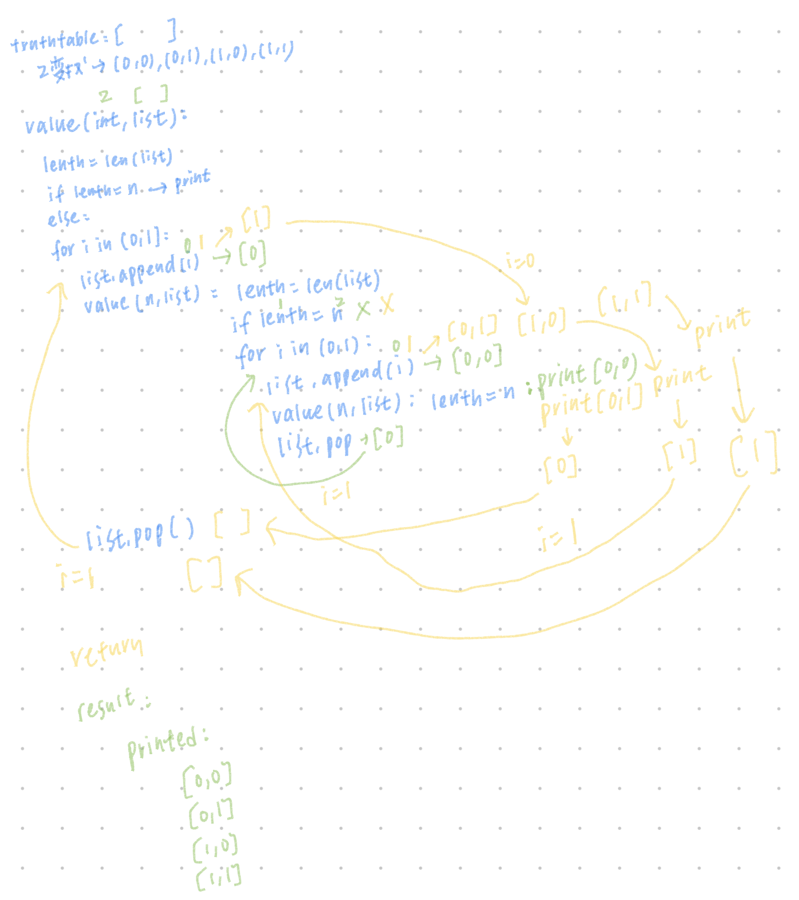

# 20230920
## 列舉法

### 介紹
```
from itertools import permutations

itertools.permutations(iterable, r=None)

# permutations('ABCD', 2) --> AB AC AD BA BC BD CA CB CD DA DB DC
# permutations(range(3)) --> 012 021 102 120 201 210 
```
[Code](iterable.permutations.py)
[Function: `itertools.permutations(iterable, r=None)`](https://docs.python.org/3/library/itertools.html#itertools.permutations)   
[Permutation - 演算法筆記](https://web.ntnu.edu.tw/~algo/Permutation.html)

### Note
truthtable.py


### HW
1. [truthtable.py](truthtable.py)
2. [permutations.py](permutations.py)

### 參考資料
https://github.com/ccc112a/py2cs/blob/master/02-演算法/02-方法/02a-列舉法/01-truthTable/truthTable.py
